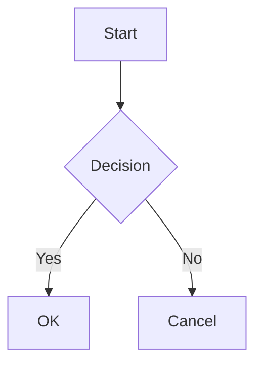

# markdown-host

A fast, self-contained CLI tool for serving markdown documentation locally. Features include syntax highlighting, Mermaid diagram support, dark mode, and the ability to serve multiple documentation roots with a unified interface.

## Features

- **Markdown rendering** with GitHub-flavored markdown support
- **Syntax highlighting** powered by Shiki with automatic light/dark theme switching
- **Mermaid diagrams** with pan, zoom, and source view controls
- **Dark mode** with system preference detection and manual toggle
- **Multi-root support** - serve multiple documentation directories with a picker UI
- **Hot reload** - automatically refreshes when files change
- **Mobile responsive** with collapsible sidebar navigation

## Installation

Requires [Bun](https://bun.sh) runtime.

```bash
# Install globally
bun install -g markdown-host

# Or run directly
bunx markdown-host ./docs
```

## Usage

```bash
# Serve a single directory
markdown-host ./docs

# Serve multiple directories
markdown-host ./docs ./api-docs ./specs

# Use a config file (auto-discovered)
markdown-host

# Specify config file explicitly
markdown-host --config ~/my-docs.json

# Override port
markdown-host --port 8080

# Enable basic auth
markdown-host --auth user:password

# Open browser on start
markdown-host --open
```

## CLI Options

| Option | Short | Description |
|--------|-------|-------------|
| `--config <file>` | `-c` | Path to config file (default: find `.markdown-host.json`) |
| `--port <port>` | `-p` | Port to listen on (default: 3000) |
| `--auth <creds>` | `-a` | Basic auth credentials (format: `user:password`) |
| `--open` | `-o` | Open browser on start |
| `--help` | `-h` | Show help message |

## Config File

Instead of passing multiple paths on the command line, create a `.markdown-host.json` file:

```json
{
  "roots": [
    "./docs",
    "../other-repo/specs",
    "/absolute/path/to/api-docs",
    { "path": "./guides", "name": "User Guides" }
  ],
  "port": 3000,
  "auth": "admin:secret"
}
```

### Config Options

| Field | Type | Description |
|-------|------|-------------|
| `roots` | `array` | **Required.** List of documentation root paths. Each item can be a string path or an object with `path` and optional `name`. |
| `port` | `number` | Port to listen on. CLI `--port` overrides this. |
| `auth` | `string` | Basic auth credentials (`user:password`). CLI `--auth` overrides this. |

### Path Resolution

- Relative paths are resolved from the config file's directory
- This makes configs portable across machines
- Absolute paths are used as-is

### Config File Discovery

When no paths are provided on the command line, markdown-host walks up from the current directory looking for `.markdown-host.json`. This allows you to run `markdown-host` from any subdirectory of your project.

## Multi-Root Mode

When serving multiple directories:

- The root URL (`/`) shows a hub page with cards for each documentation set
- Each root is accessible at `/<slug>/...` (e.g., `/docs/getting-started`)
- A dropdown picker in the sidebar allows switching between roots
- Slugs are auto-generated from directory names, with disambiguation when needed

## Markdown Features

### Frontmatter

```yaml
---
title: Page Title
order: 1
---
```

- `title` - Display name in navigation (defaults to humanized filename)
- `order` - Sort order in navigation (lower numbers first)

### Mermaid Diagrams

````markdown

````

Diagrams include controls for:
- Zoom in/out and reset
- Fit to container
- Toggle source code view

### Code Highlighting

Syntax highlighting is automatic for fenced code blocks with language identifiers:

````markdown
```typescript
function hello(name: string): string {
  return `Hello, ${name}!`;
}
```
````

## Environment Variables

| Variable | Description |
|----------|-------------|
| `MARKDOWN_HOST_AUTH` | Basic auth credentials (alternative to `--auth`) |

## Navigation Structure

Files are organized in the sidebar based on directory structure:

- `index.md`, `README.md`, and `overview.md` are prioritized at the top of each folder
- Directories appear before files
- Items with `order` frontmatter are sorted accordingly
- Remaining items are sorted alphabetically

### Acronym Handling

Common acronyms are automatically capitalized in navigation:
- `api-reference` → "API Reference"
- `ml-models` → "ML Models"
- `ui-components` → "UI Components"

## Development

```bash
# Install dependencies
bun install

# Build CSS
bun run build:css

# Run in development
bun run dev ./docs

# Type check
bun run typecheck
```

## License

MIT
